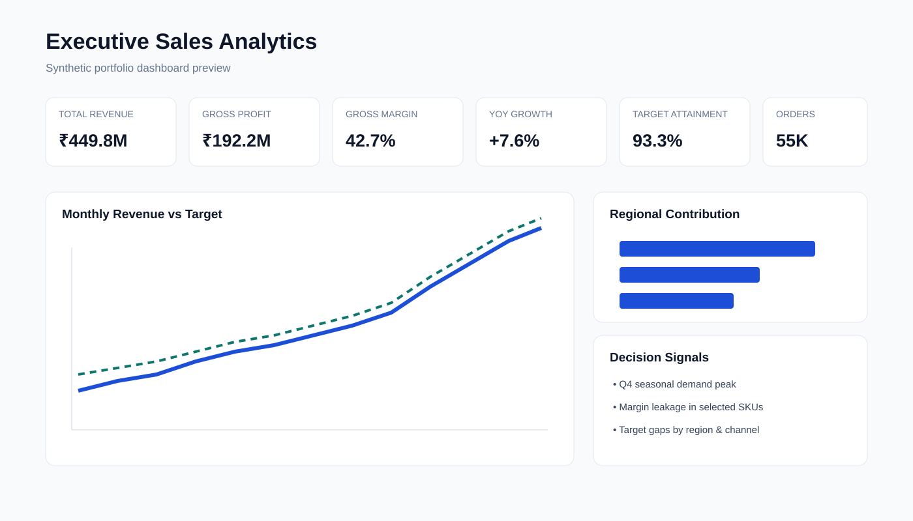
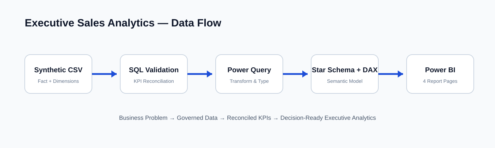

# Executive Sales Analytics

Recruiter-ready **Power BI + SQL + DAX + Power Query** portfolio project using a fully synthetic consumer-products sales dataset.

> **Synthetic portfolio dataset — created for demonstration purposes. No employer or confidential data is used.**



## Business Problem
A multi-region consumer-products company needs one trusted executive view of revenue, gross profit, margin, target attainment, product performance, regional trends, channel performance, and sales-team effectiveness.

## Project Scale
- 55,000 synthetic sales transactions
- 24 months: 2024–2025
- 1,500 customers
- 24 products across 4 categories
- 12 countries / 5 regions
- 20 salespeople
- 4 sales channels

## Tech Stack
Power BI, SQL, DAX, Power Query, Python, CSV, Star Schema.

## Architecture


## Repository Structure
- `scripts/` — reproducible synthetic-data generator
- `sql/` — schema and analytical validation queries
- `power_query/` — M transformation logic
- `dax/` — reusable DAX measures
- `powerbi/` — dashboard build specification and Power BI theme
- `docs/` — BRD, data model, data dictionary, insights, recommendations, interview walkthrough
- `assets/` — recruiter-facing dashboard and architecture previews

## Data Model
Star schema with `FactSales` in the center and six dimensions: `DimDate`, `DimCustomer`, `DimGeography`, `DimProduct`, `DimChannel`, and `DimSalesperson`.

## Core KPIs
Total Revenue, Gross Profit, Gross Margin %, YoY Growth %, Target Attainment %, Average Order Value, Units Sold, Revenue per Customer, Regional Contribution %, Average Discount %, Salesperson Rank.

## Reproduce the Dataset
```bash
pip install -r requirements.txt
python scripts/generate_data.py
```

This generates the 55,000-row fact table and all dimension CSVs under `generated/`. Generated datasets are ignored by Git because the source generator is the reproducible public artifact.

## Power BI Build
1. Generate or load the CSVs.
2. Apply the included Power Query transformation.
3. Build the star-schema relationships described in `docs/Data_Model.md`.
4. Add measures from `dax/Measures.dax`.
5. Import `powerbi/Executive_Sales_Theme.json`.
6. Build the four report pages from `powerbi/Dashboard_Build_Spec.md`.

## Report Pages
1. Executive Overview
2. Regional & Product Performance
3. Sales Team Performance
4. Trends & Drivers

## Documentation
- [Business Requirements](docs/BRD.md)
- [Data Model](docs/Data_Model.md)
- [Data Dictionary](docs/Data_Dictionary.md)
- [Insights & Recommendations](docs/Insights_and_Recommendations.md)
- [Interview Walkthrough](docs/Interview_Walkthrough.md)
- [Dashboard Build Specification](powerbi/Dashboard_Build_Spec.md)

## Portfolio Story
**Business problem → requirements → synthetic data → SQL validation → Power Query → star schema → DAX → dashboard → insights → recommendations.**

## Author
**Sriram Selvam** — Data / BI / Business Analysis Portfolio
